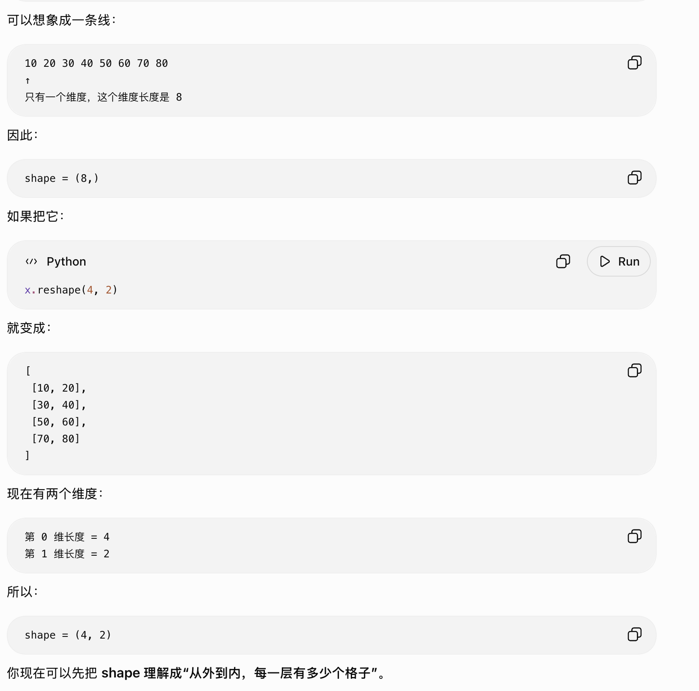
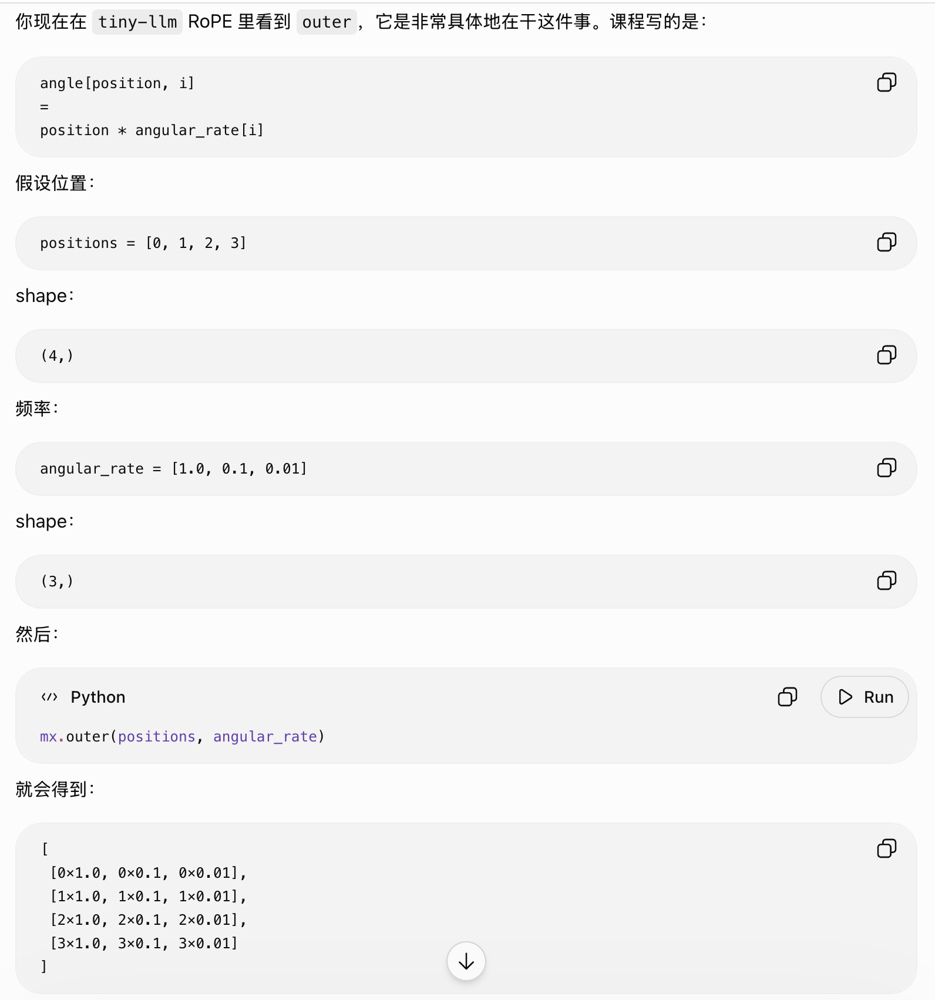
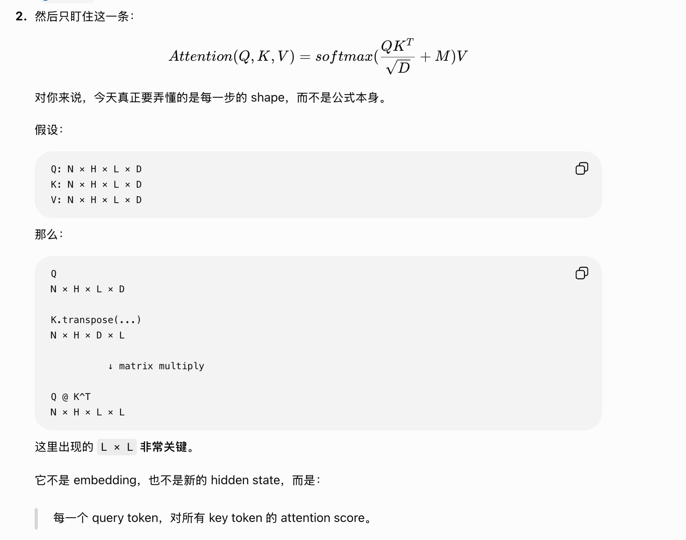

# Date 0918 — Tension manipulation

Lab1

- Day 1：Attention / Multi-Head Attention

- Day 2：Positional Encoding + RoPE**

  


## Today: What I Done
- geometrix understanding of linear alg
- Task 1 写 `scaled_dot_product_attention_simple`
Afternoon
1. 3Blue1Brown 补空间直觉：解决“为什么这个矩阵操作有意义”
2. Andrej 的课程 补算法语境：解决“attention / softmax 在模型里到底干什么”
3. 自己写 Task 1 + 跑 test：把前两步立刻变成可验证的实现

## Tomorrow: To Do
- 
- 


## Notes

### tensor / ndarray 操作的基本心智模型

**不要暂停 tiny-llm 去系统学 PyTorch。**

直接开始 `positional_encoding.py`。

每碰到一个 MLX operation 不认识，就查这一个。

每写一段，先问自己 shape 是多少。

Week 1 做完以后，再花 1–2 小时补一个 PyTorch tensor crash course。


shape 怎么变化
broadcast 为什么成立
最后一维代表什么


mx.arange
mx.power
mx.outer
mx.cos
mx.sin

reshape
slice
stack / concatenate
astype


Python 里(8,)才表示“只有一个元素的 tuple。没有，只是数字 `8` 加括号

tensor 的 `shape` 本身通常就是一个 tuple，所以一维 tensor 的 shape 必须写成：

```python
(8,)
```





dot / 内积
两个向量 → 一个数
“把对应位置相乘再加起来”

Q dot K:本质上就是在算两个向量的相似程度，这个 query 和这个 key 在表示空间里有多匹配？

空间里的几何变化，3blue1brown，Chapter 3 — Linear transformations and matrices

chapter 1 2 3 4 9（skip other right now）

https://www.bilibili.com/video/BV1ys411472E/?spm_id_from=333.1387.collection.video_card.click&vd_source=fdeeda7e821158681d7294658a429bc1

> 两个向量方向有多一致。

方向越接近，内积通常越大；方向相反，内积可能是负的；垂直时内积是 0。

outer / 外积
两个向量 → 一个矩阵
“所有元素两两组合相乘”




 RoPE 本身就是把每两维当成一个二维平面，然后按照位置旋转

只需要补这几个几何直觉：

1. **vector**：空间里的一个点/方向，也可以理解成一串特征。
2. **dot product**：两个向量有多对齐。
3. **matrix multiplication**：把向量从一个表示空间变换到另一个空间。
4. **outer product**：当前阶段先理解为“所有 pairwise multiplication，生成二维表”。
5. **rotation**：RoPE 里尤其重要，就是二维平面里的旋转。


Karpathy 最直接讲 attention head 的视频就是 **“Let’s build GPT: from scratch, in code, spelled out.”**。他会从最简单的“过去 token 怎么聚合”一路推到真正的 self-attention，然后再讲 single head 和 multi-head

你不用整段两小时都看。针对你现在正在理解的 `head / QK / shape`，直接看这几段最值：

- **01:02:00** — 真正开始构建 self-attention
- **01:11:38** — attention as communication
- **01:16:56** — 为什么要除以 `sqrt(head_size)`
- **01:19:11** — single self-attention block
- **01:21:59** — multi-headed self-attention
- **01:46:22** — batched multi-head attention 的代码快速 walkthrough


###  Task1




scaled_dot_product_attention_simple

scores = Q @ K^T
scores = scores * scale
scores = scores + mask
weights = softmax(scores)
output = weights @ V

### 


### 


### 


## 🔥 Failure Hypotheses

## 🔗 Systems Analogy

## 🧠 Mental Model Update
第一个闭环任务
直觉 → 机制 → 实现 → 反馈