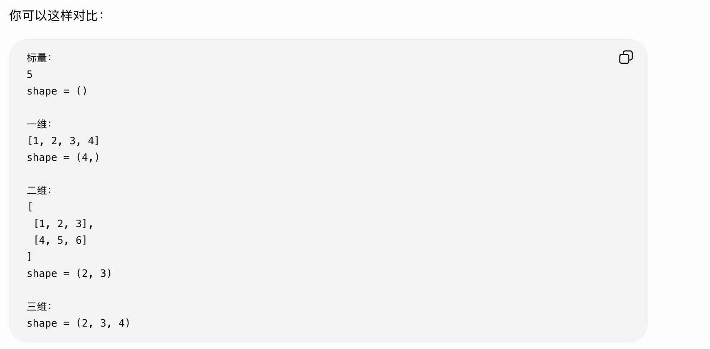

# Date 0918 — Tension manipulation


## Today: What I Done
- 
- 

## Tomorrow: To Do
- 
- 


## Notes

### tensor / ndarray 操作的基本心智模型

**不要暂停 tiny-llm 去系统学 PyTorch。**

直接开始 `positional_encoding.py`。

每碰到一个 MLX operation 不认识，就查这一个。

每写一段，先问自己 shape 是多少。

Week 1 做完以后，再花 1–2 小时补一个 PyTorch tensor crash course。


shape 怎么变化
broadcast 为什么成立
最后一维代表什么

x.shape

x[..., :half]
x[..., half:]

x.reshape(...)

mx.arange(...)
mx.outer(...)
mx.cos(...)
mx.sin(...)

a * b
a + b


Python 里(8,)才表示“只有一个元素的 tuple。没有，只是数字 `8` 加括号

tensor 的 `shape` 本身通常就是一个 tuple，所以一维 tensor 的 shape 必须写成：

```python
(8,)
```



### 


### 


### 


### 


## 🔥 Failure Hypotheses

## 🔗 Systems Analogy

## 🧠 Mental Model Update